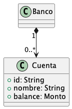
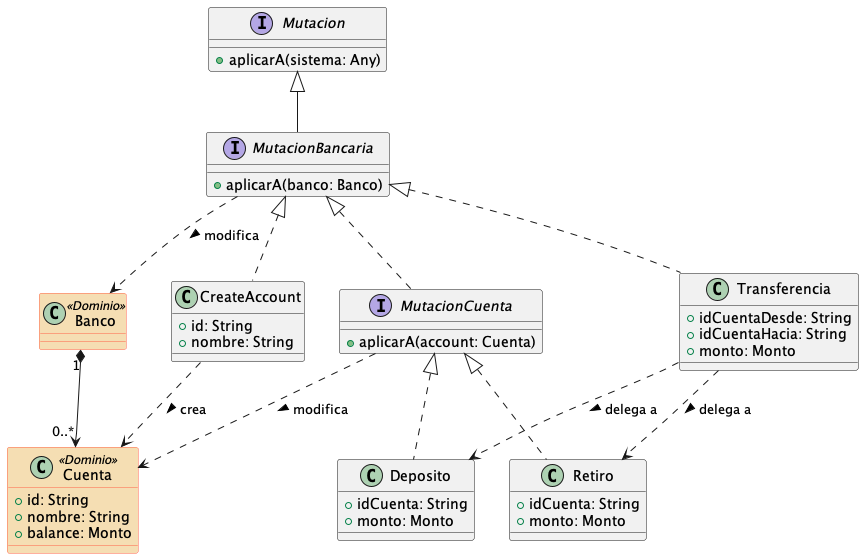
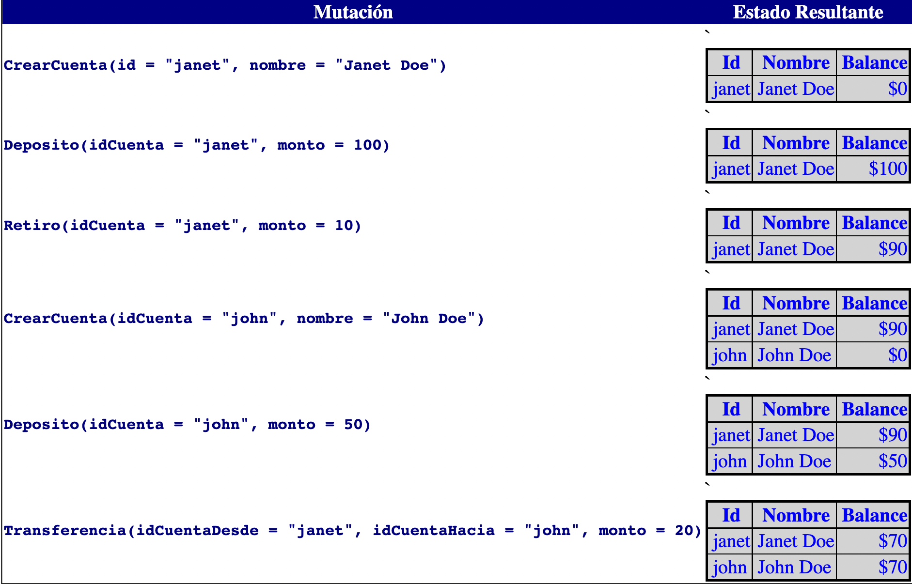
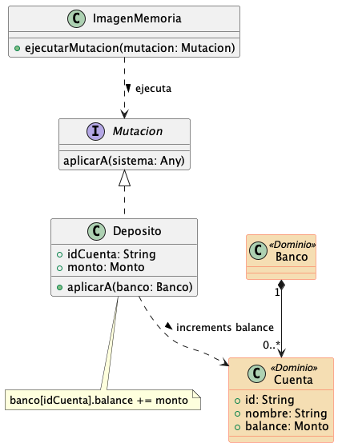
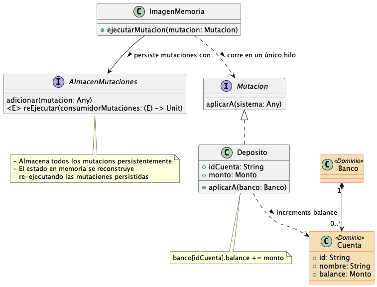
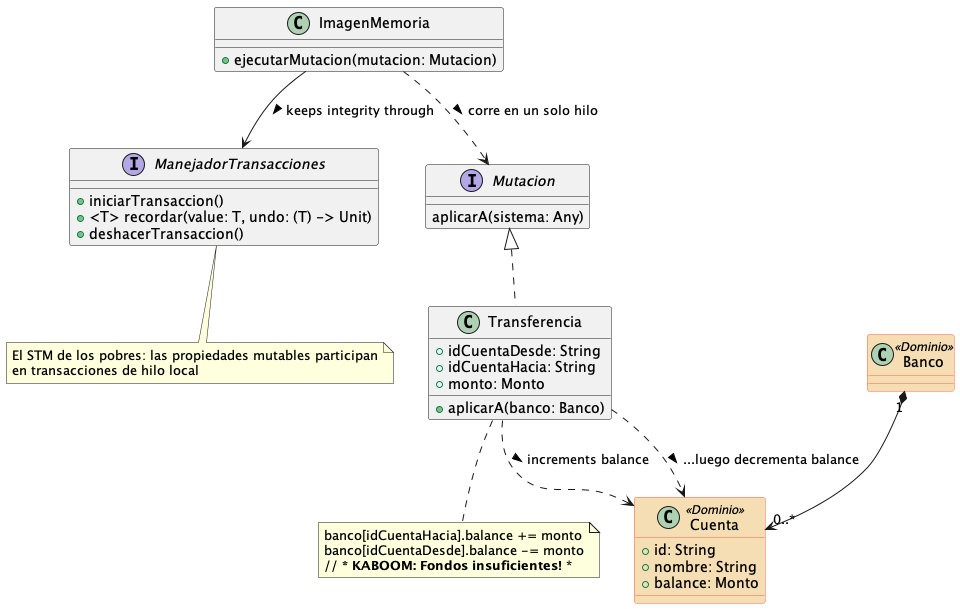
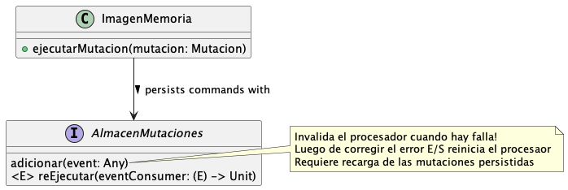
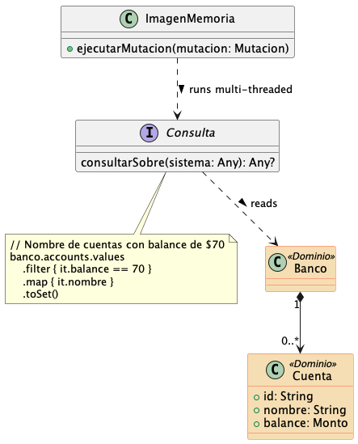
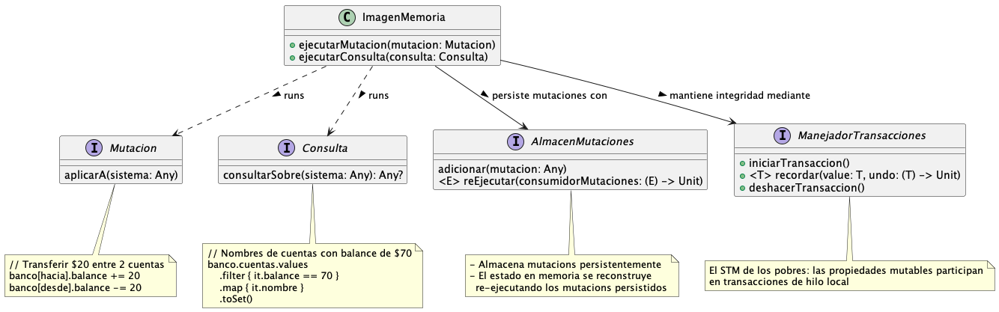

# Imagen en Memoria: Ejemplo de Programación Funcional en Kotlin

> Cuando las personas inician el desarrollo de una aplicación empresarial, una de las primeras preguntas que se
> hacen es "cómo hablamos con la base de datos?". En estos días pueden hacer una pregunta ligeramente diferente:
> "qué tipo de base de datos deberíamos usar, relacional o una de estas bases de datos NoSql?".
>
> Pero hay otra pregunta a considerar: “_Deberíamos usar una base de datos en primer lugar?_”
>
> — Martín Fowler

### Qué es una _imagen en memoria_?

La imagen en memoria proporciona un mecanismo de persistencia confiable en el que todos los datos de la aplicación
residen de forma segura en la memoria principal. Sí: nos referimos a la memoria RAM, volátil y todo.

Siempre que el modelo de dominio quepa en la memoria principal (que es barata y abundante hoy en día), este enfoque
produce beneficios significativos sobre el enfoque tradicional centrado en la base de datos:

- Tiempos de procesamiento de consultas y transacciones sustancialmente más rápidos, ya que el sistema opera a
  velocidades de RAM!
- No
  hay [impedancia entre objetos y tablas](https://es.wikipedia.org/wiki/Adaptaci%C3%B3n_de_impedancias_objeto-relacional):
  los objetos _solo_ residen de forma nativa en la memoria. No hay
  limitaciones de implementación de [ORM](https://es.wikipedia.org/wiki/Asignaci%C3%B3n_objeto-relacional) que
  burbujean hasta el nivel de diseño
- Modelos de dominio mucho más ricos que aprovechan las funciones avanzadas del lenguaje y plataforma. No hay
  problemas de persistencia. El nirvana del [DDD](https://es.wikipedia.org/wiki/Dise%C3%B1o_guiado_por_el_dominio);
  la cura para los [modelos de dominio anémicos](https://es.wikipedia.org/wiki/Modelo_de_dominio_an%C3%A9mico) 😉

### Hmm... Por favor, explíquese

En lugar de persistir las entidades de dominio como tales (como se hace, típicamente, en una base de datos), en el
enfoque de imagen en memoria lo que se persiste es la secuencia de eventos de aplicación que modifican el estado de
las entidades.

Considere el siguiente modelo de dominio bancario minimalista:



Aquí, un banco tiene una colección de cuentas, cada una con un balance que cambia en el tiempo a medida que responde a
eventos de mutación del balance tales como:

- Depósitos
- Retiros
- Transferencias

Cada uno de estos eventos se puede modelar como un 
[comando](https://es.wikipedia.org/wiki/Command_(patr%C3%B3n_de_dise%C3%B1o)) 
de mutación que, cuando se aplica a una cuenta, modifica su saldo para reflejar la operación bancaria correspondiente.

Esto podría modelarse como:



Echemos un vistazo a una progresión de comandos y a la evolución del estado del sistema resultante de su aplicación 
sucesiva:



La idea clave detrás del patrón de imagen en memoria es:

> 1. Serializar todos las mutaciones de estado en almacenamiento persistente
>
> 2. Reconstruir el estado de la aplicación en memoria aplicando a un estado inicial vacío, en orden, todas las
     > mutaciones serializadas

Algo paradójicamente, las clases de entidad como tales nunca se persisten! (Pero puede serializadas cuando se les
toman "fotografías instantáneas" como se comenta más abajo).

Si los datos de la aplicación caben en la memoria y la historia de mutaciones cabe en el disco entonces es posible
tomar ventaja de la imagen en memoria.

### Procesador de Imagen en Memoria

Un _procesador de imagen en memoria_ consume una secuencia de mutaciones aplicándolas sucesivamente a un objeto
mutable en memoria (al que llamaremos _sistema_ empleando la terminología introducida por los pioneros de
[Prevayler](https://prevayler.org).



Puesto que la aplicación de comandos de mutación en memoria es tan rápida y barata, el procesador de imagen en
memoria puede correr en un único hilo! Esto le permite consumir las mutaciones entrantes secuencialmente sin tener
que ocuparse de problemas de contención por acceso mutable concurrente. Esto, a su vez, remueve mucho de la complejidad
transaccional tradicionalmente asociada con las transacciones pues los conflictos por mutación concurrentemente, 
simplemente, no ocurren!

)

La aplicación de mutaciones individuales, sin embargo, _puede_ fallar en medio de una secuencia de modificaciones. Por
esta razón el procesador de imagen en memoria todavía es responsable de deshacer cambios parciales en memoria y
restaurar la integridad del sistema cuando ocurran errores por datos inválidos o violaciones a reglas de integridad
del dominio de negocios.



Las mutaciones entrantes solo se serializan cuando su ejecución se ha completado exitosamente. Obviamente, si la
serialización misma falla, el procesador debe detenerse y dejar de consumir ulteriores mutaciones hasta que se
restaure la capacidad de serialización.



Por último (y crucialmente!) un procesador de image en memoria también sirve consultas

Una _consulta_ es otro tipo de eventos que, a diferencia de las mutaciones, no altera el estado del sistema. Es de
importancia notar que las consultas se sirven en modo multi-hilo, de forma que interrogar el estado del sistema es
una operación eficiente y concurrente. Puesto que el acceso a los datos en memoria es tan rápido muchas consultas se
pueden satisfacer sin necesidad de indexar los datos. Sin embargo, es fácil indexar datos en memoria según sea
requerido por la aplicación.



El siguiente diagrama de clases resume el modelo del procesador de imagen en memoria:

)

👉 Puesto que la reiniciación de la aplicación puede tomar cierto largo cuando hay una larga historia de mutaciones, es
posible tomar, a demanda, una "fotografía instantánea" en disco del estado del sistema en memoria. Esto posibilita
reiniciaciones más rápidas a expensas de reducir la capacidad de "viajar en el tiempo" posibilitada por la historia 
completa de mutaciones.

### Procesador de Imagen en Memoria Implementado en Kotlin

El diagrama de clases anterior se materializa en Kotlin, empleando un estilo funcional, como:

```kotlin
interface Mutacion<S, R> {
    fun ejecutarSobre(sistema: S): R?
}

interface Consulta<S, R> {
    fun consultarSobre(sistema: S): R?
}

class ImagenMemoria(private val sistema: Any, 
                    private val almacenMutaciones: AlmacenMutaciones) {

    init {
        synchronized(sistema) {
            almacenMutaciones.reEjecutar {
                    mutacion: Mutacion<Any, Any> -> mutacion.ejecutarSobre(sistema) 
            }
        }
    }

    fun <S, R> ejecutarMutation(mutacion: Mutacion<S, R>): Either<Falla, R?> =
        ManejadorTransacciones.correrEnTransaccion {
            @Suppress("UNCHECKED_CAST")
            Either.catch { mutacion.ejecutarSobre(sistema as S) }
                .mapLeft { FallaAplicacion("Ejecutando mutación", it) }
                .flatMap { result ->
                    Either.catch { almacenMutaciones.adicionar(mutacion) }
                        .mapLeft { FallaSistema("Serializando mutación", it) }
                        .map { result }
                }
        }

    fun <S, R> ejecutarConsulta(consulta: Consulta<S, R>): Either<Falla, R?> =
        @Suppress("UNCHECKED_CAST")
        Either.catch { consulta.consultarSobre(sistema as S) }
            .mapLeft { FallaAplicacion("Ejecutando consulta", it) }
}
```

👉 Esta implementación utiliza la librería Kotlin de programación funcional [Arrow](https://arrow-kt.io).

### Ejemplo Simple: Modelo de Dominio Bancario

Para ejercitar el procesador de imagen en memoria arriba presentado, revisitemos nuestro modelo bancario:


Este modelo se implementa en Kotlin como:

```kotlin
typealias Monto = BigDecimal

data class Banco(val cuentas: MutableMap<String, Cuenta> = HashMap())

data class Cuenta(val id: String, val nombre: String) {
    var balance: Monto by DelegadoTransaccional(Monto.ZERO) { it >= Monto.ZERO }
}

interface MutacionBancaria<R> : Mutacion<Banco, R> {
    fun ejecutarSobreBanco(banco: Banco): R?
    override fun ejecutarSobre(sistema: Banco): R? = ejecutarSobreBanco(sistema)
}

interface ConsultaBancaria<R> : Consulta<Banco, R> {
    fun consultarSobreBanco(banco: Banco): R?
    override fun consultarSobre(sistema: Banco): R? = consultarSobreBanco(sistema)
}

interface MutacionCuenta : MutacionBancaria<Unit> {
    val idCuenta: String
    fun aplicarA(cuenta: Cuenta)
    override fun ejecutarSobreBanco(banco: Banco) {
        aplicarA(banco.cuentas[idCuenta]!!)
    }
}

data class CrearCuenta(val id: String, val nombre: String) : MutacionBancaria<Unit> {
    override fun ejecutarSobreBanco(banco: Banco) {
        banco.cuentas[id] = Cuenta(id, nombre)
    }
}

data class Deposito(override val idCuenta: String, val monto: Monto) : MutacionCuenta {
    override fun aplicarA(cuenta: Cuenta) {
        cuenta.balance += monto
    }
}

data class Retiro(override val idCuenta: String, val monto: Monto) : MutacionCuenta {
    override fun aplicarA(cuenta: Cuenta) {
        cuenta.balance -= monto
    }
}

data class Transferencia(val idCuentaDesde: String, val idCuentaHacia: String, val monto: Monto) :
    MutacionBancaria<Unit> {
    override fun ejecutarSobreBanco(banco: Banco) {
        Deposito(idCuentaHacia, monto).ejecutarSobre(banco)
        Retiro(idCuentaDesde, monto).ejecutarSobre(banco)
    }
}
```

### Ejemplo Simple: Probando el Procesador

The following test exercises the memory image processor using the same sequence of commands outlined above:
La siguiente prueba de integración ejercita el procesador de imagen de memoria empleando la misma secuencia de 
mutaciones ilustrada anteriormente:

```kotlin
val banco = Banco()
val almacenMutaciones = AlmacenMutacionesEnMemoria()
val imagenMemoria = ImagenMemoria(banco, almacenMutaciones)

fun balanceDe(id: String) = banco.cuentas[id]!!.balance.toInt()

with(Probador<Banco>(imagenMemoria)) {

    verificarEfecto(CrearCuenta("janet", "Janet Doe")) {
        balanceDe("janet") == 0
    }

    verificarEfecto(Deposito("janet", Monto(100))) {
        balanceDe("janet") == 100
    }

    verificarEfecto(Retiro("janet", Monto(10))) {
        balanceDe("janet") == 90
    }

    verificarEfecto(CrearCuenta("john", "John Doe")) {
        balanceDe("john") == 0
    }

    verificarEfecto(Deposito("john", Monto(50))) {
        balanceDe("john") == 50
    }

    verificarQue(Transferencia("janet", "john", Monto(20))) {
        assertEquals(70, balanceDe("janet"))
        assertEquals(70, balanceDe("john"))
    }
```

### Conclusión

La imagen en memoria proporciona una forma simple y directa de lograr un alto rendimiento y simplicidad sin las
complicaciones asociadas con la persistencia de objetos en una base de datos (ya sea SQL o no).

Kotlin es un lenguaje expresivo único en el que implementar este patrón arquitectónico gracias, entre otros, a sus 
amplias capacidades funcionales!


